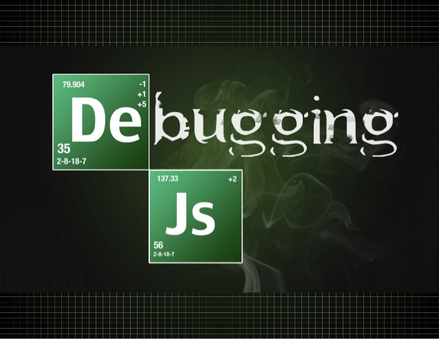

# Debugging-JavaScript
Freecodecamp challenges on debugging JavaScript code
<inline>

  </inline>
---------------------------------------
- ["Use the JavaScript Console to Check the Value of a Variable](https://github.com/Afroprogrammer/debugging-JavaScript/blob/master/use-the-javascript-console-to-check-the-value-of-a-variable.js)
- [Understanding the Differences between the freeCodeCamp and Browser Console](https://github.com/Afroprogrammer/debugging-JavaScript/blob/master/understanding-the-differences-between-the-freecodecamp-and-browser-console.js)
- [Use typeof to Check the Type of a Variable](https://github.com/Afroprogrammer/debugging-JavaScript/blob/master/use-typeof-to-check-the-type-of-a-variable.js)
- [Catch Misspelled Variable and Function Names](https://github.com/Afroprogrammer/debugging-JavaScript/blob/master/catch-misspelled-variable-and-function-names.js)
- [Catch Unclosed Parentheses, Brackets, Braces and Quotes](https://github.com/Afroprogrammer/debugging-JavaScript/blob/master/catch-unclosed-parentheses-brackets-braces-and-quotes.js)
- [Catch Mixed Usage of Single and Double Quotes](https://github.com/Afroprogrammer/debugging-JavaScript/blob/master/catch-mixed-usage-of-single-and-double-quotes.js)
- [Catch Use of Assignment Operator Instead of Equality Operator](https://github.com/Afroprogrammer/debugging-JavaScript/blob/master/catch-use-of-assignment-operator-instead-of-equality-operator.js)
- [Catch Missing Open and Closing Parenthesis After a Function Call](https://github.com/Afroprogrammer/debugging-JavaScript/blob/master/catch-missing-open-and-closing-parenthesis-after-a-function-call.js)
- [Catch Arguments Passed in the Wrong Order When Calling a Function](https://github.com/Afroprogrammer/debugging-JavaScript/blob/master/catch-arguments-passed-in-the-wrong-order-when-calling-a-function.js)
- [Catch Off By One Errors When Using Indexing](https://github.com/Afroprogrammer/debugging-JavaScript/blob/master/catch-off-by-one-errors-when-using-indexing.js)
- [Use Caution When Reinitializing Variables Inside a Loop](https://github.com/Afroprogrammer/debugging-JavaScript/blob/master/use-caution-when-reinitializing-variables-inside-a-loop.js)
- [Prevent Infinite Loops with a Valid Terminal Condition](https://github.com/Afroprogrammer/debugging-JavaScript/blob/master/prevent-infinite-loops-with-a-valid-terminal-condition.js)
